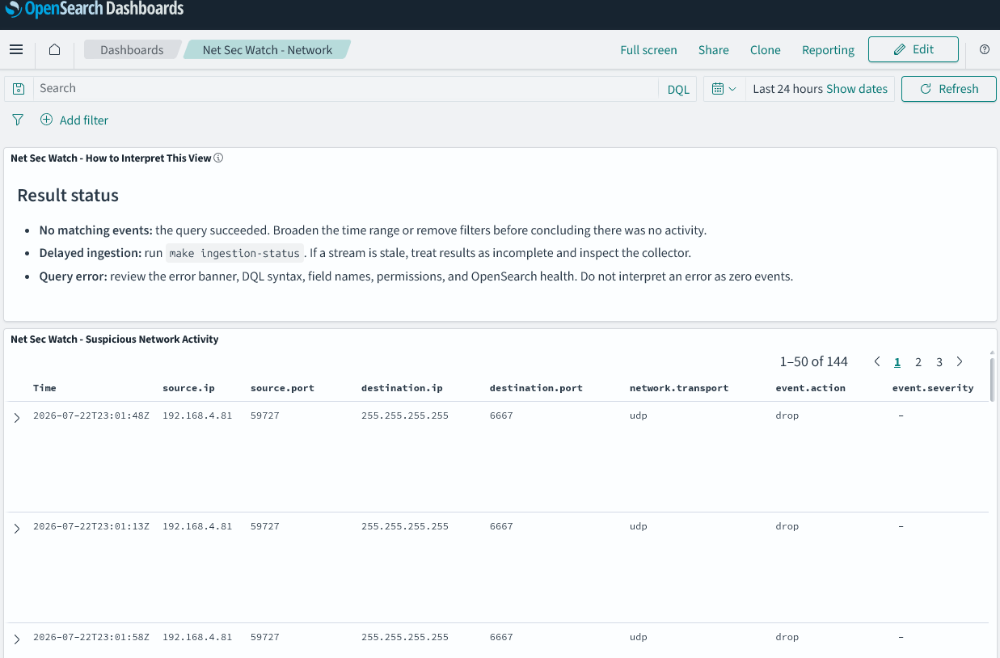
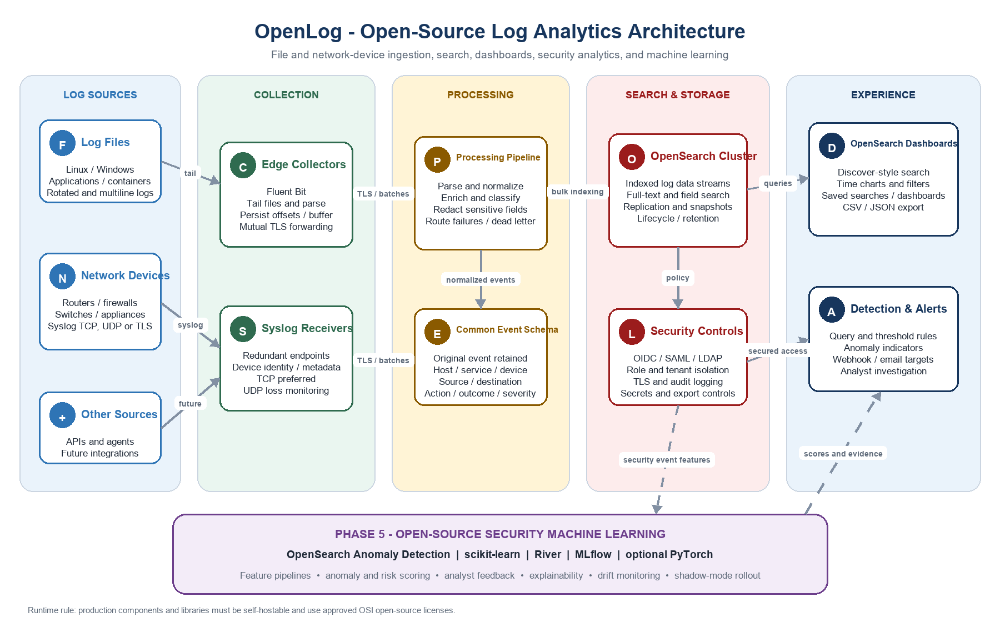
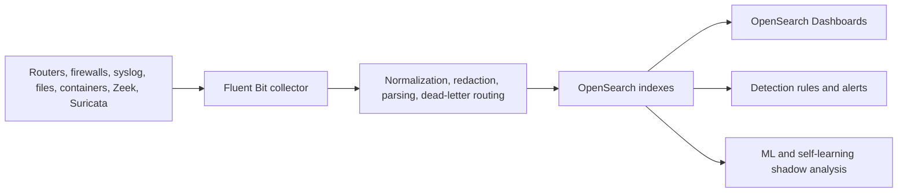

# Net Sec Watch

Net Sec Watch is an open-source, self-hostable SIEM-style platform for
collecting, normalizing, searching, dashboarding, and analyzing security logs
from files, Linux hosts, containers, routers, firewalls, and optional network
sensors.

Author: SJ du Preez





## What you can do with it

- Pull logs from routers, firewalls, syslog devices, local files, containers,
  Linux system logs, Zeek, and Suricata.
- Normalize events into a consistent security schema while keeping the original
  raw event for investigation.
- Search events in OpenSearch and view them in OpenSearch Dashboards.
- Add saved searches, filters, dashboards, and analyst views.
- Run deterministic security detections and produce normalized alerts.
- Test machine-learning and self-learning traffic-analysis workflows in
  governed shadow mode before trusting automation.
- Run locally with Docker Compose, or use the deployment artifacts for Linux VM
  and Kubernetes-style environments.

This README gives the short path from install to usable platform. Deeper
references are linked throughout and collected in [docs/index.md](docs/index.md).

## How the platform fits together



Default local ports:

| Service | URL or port | Purpose |
| --- | --- | --- |
| Syslog UDP/TCP | `514` | Router, firewall, and device log ingestion |
| Syslog TLS | `6514` | Encrypted syslog ingestion |
| Fluent Bit health | `http://127.0.0.1:2020/api/v1/health` | Collector health check |
| OpenSearch | `http://127.0.0.1:9200` | Search API |
| OpenSearch Dashboards | `http://127.0.0.1:5601` | Browser UI |

## Quick start: get a dashboard with data

Prerequisites: Git, Docker Engine/Desktop with the Docker Compose v2 plugin,
`make`, `openssl`, `python3`, and WSL2 if running on Windows.

```bash
git clone git@github.com:Buglish/net-sec-watch.git
cd net-sec-watch
make dashboard-demo
```

That command does the consumer-friendly setup path:

1. Creates ignored local config files from the examples.
2. Starts Fluent Bit, OpenSearch, and OpenSearch Dashboards.
3. Imports the Net Sec Watch data view, saved searches, and dashboards.
4. Generates sample log files.
5. Sends a demo syslog event with marker `NetSecWatchDemo001`.

Open:

```text
http://127.0.0.1:5601
```

Then:

1. Go to **Discover**.
2. Select the **Net Sec Watch** data view.
3. Search for:

   ```text
   NetSecWatchDemo001
   ```

If you see the marker event, the collector, OpenSearch storage, dashboard
saved objects, and sample ingestion path are working.

Useful checks:

```bash
curl http://127.0.0.1:2020/api/v1/health
make logs
```

Stop everything with:

```bash
make down
```

If Dashboards opens but the Net Sec Watch data view is missing, re-import the
saved objects:

```bash
make import-dashboards
```

For the longer operator walkthrough, including real router/firewall ingestion,
secure profiles, Zeek, Suricata, and troubleshooting, see the
[administrator guide](docs/guides/admin-guide.md).

## Manual setup path

Use this if you want to run each step yourself:

```bash
make init
make check
make up
make up-dashboards
make import-dashboards
make generate
./scripts/send-demo-syslog.sh
```

Then open `http://127.0.0.1:5601`, go to **Discover**, select the Net Sec
Watch data view, and search for `NetSecWatchDemo001`.

For a real router or firewall, point its remote syslog setting to:

```text
<net-sec-watch-host-ip>:514/UDP
```

Example:

```text
192.168.1.209:514/UDP
```

More ingestion detail is in [docs/guides/ingestion.md](docs/guides/ingestion.md).

## 1. Add a search, filter, or dashboard

**Requires:** a running Dashboards UI with saved objects imported. The easiest
path is `make dashboard-demo`; the manual path is `make up-dashboards` followed
by `make import-dashboards`.

The simple workflow is:

1. Open **Discover** in OpenSearch Dashboards.
2. Build a search using filters, for example:

   ```text
   event.kind:alert OR log.syslog.severity.name:(warning OR error)
   ```

3. Save it as a saved search.
4. Open **Dashboard**.
5. Add the saved search or add visualizations.
6. Export the saved object if you want it managed in Git.
7. Store managed dashboard objects under `config/dashboards/`.

Existing dashboard assets live here:

| Path | Purpose |
| --- | --- |
| `config/dashboards/data-views-v1.ndjson` | Data views |
| `config/dashboards/saved-searches-v1.ndjson` | Saved searches |
| `config/dashboards/dashboards-v1.ndjson` | Dashboard layouts |
| `config/dashboards/search-examples-v1.json` | Example analyst searches |
| `config/dashboards/managed-saved-objects-v1.ndjson` | Managed saved objects |

Run dashboard checks:

```bash
make test-opensearch-dashboards
make test-dashboards-reproducibility
```

## 2. Add filters and parsing logic

**Requires:** nothing running — this is config editing. `make test-golden`
needs only `python3`; `make test-integration` needs Docker to replay real
events through the changed config.

Use filters when you need to enrich, redact, normalize, or route events.

Main places to edit:

| Path | Purpose |
| --- | --- |
| `config/fluent-bit.conf` | Main collector pipeline |
| `config/fluent-bit.local.conf` | Local overrides |
| `config/parsers-custom.conf` | Custom parsers |
| `config/scripts/canonical_normalization.lua` | Common normalized fields |
| `config/scripts/network_normalization.lua` | Network field normalization |
| `config/scripts/sensitive_redaction.lua` | Redaction of sensitive values |
| `config/scripts/syslog_metadata.lua` | Syslog enrichment |
| `config/schema/canonical-event-schema-v1.json` | Expected event shape |

Good rule of thumb:

- Parse as little as needed at the input edge.
- Keep `event.original` so investigations can always see the raw source log.
- Route bad events to dead-letter instead of silently dropping them.
- Add tests when changing parsing behavior.

Useful validation:

```bash
make test-golden
make test-integration
make test-opensearch-searchability
```

## 3. Use detections and alerts

**Requires:** nothing running — `scripts/run-detections.py` evaluates a
JSONL file of events directly (`--events`), no OpenSearch connection needed.
Wire alerts into Dashboards once you have real ingested data to search over.

Detection content is under `config/detections/`.

Important files:

| Path | Purpose |
| --- | --- |
| `config/detections/rules-v1.json` | Detection rules |
| `config/detections/alert-schema-v1.json` | Normalized alert shape |
| `config/detections/detection-use-cases-v1.json` | Use-case mapping |
| `config/detections/asset-criticality-v1.json` | Asset importance |
| `config/detections/source-confidence-v1.json` | Source confidence scoring |
| `config/detections/dedup-suppression-v1.json` | Alert suppression policy |
| `config/detections/false-positive-register-v1.json` | Analyst-approved false positives |
| `config/detections/notification-destinations-v1.json` | Alert destination contracts |

Run detection validation:

```bash
make test-detections
```

Use detections with dashboards by filtering for alert fields, detection rule
names, severity, asset criticality, or source confidence. Keep detections
source-agnostic where possible so the same rule can work across router,
firewall, Zeek, Suricata, and host events.

## 4. Use machine learning features

**Requires:** nothing running — `scripts/ml-shadow-score.py` scores a JSONL
file of events against a registered model file (`--events`,
`--model-metadata`), no live OpenSearch or dashboard needed for scoring
itself. Step 5 below covers viewing the output in Dashboards.

The ML layer is intentionally governed. It is designed for shadow analysis and
analyst review first, not automatic blocking.

ML assets are under `config/ml/`.

Important files:

| Path | Purpose |
| --- | --- |
| `config/ml/ml-use-case-v1.json` | Security ML use cases |
| `config/ml/dataset-policy-v1.json` | Dataset governance |
| `config/ml/baselines-v1.json` | Baseline behavior definitions |
| `config/ml/drift-monitoring-v1.json` | Drift checks |
| `config/ml/model-serving-api-v1.json` | Model serving contract |
| `config/ml/ml-lifecycle-v1.json` | Review and promotion lifecycle |
| `config/ml/analyst-feedback-example.json` | Example analyst feedback |

Run ML validation:

```bash
make test-ml
```

How to use ML with dashboards:

1. Ingest enough normalized events for the source you care about.
2. Keep ML in shadow mode.
3. Write prediction or score outputs to the prediction index/template.
4. In Dashboards, create filters for fields such as model name, prediction
   class, anomaly score, confidence, source type, and analyst disposition.
5. Compare ML output with deterministic detections before promoting anything.

The safest operating model is:

```text
ML suggests -> analyst reviews -> detection is tuned -> automation is approved later
```

## 5. Use the self-learning traffic features

**Requires:** the underlying scripts (`traffic-classifier-service.py`,
`model-orchestrator.py`) run offline against `--events` files like the ML
scripts above and need nothing running. The `orchestration` Compose profile
below is only for running them continuously as services, and it needs the
`opensearch` profile enabled too (`traffic-classifier` writes results there).

The self-learning features are the adaptive traffic-intelligence and
orchestration experiments. They classify unknown traffic, produce candidate
model updates, and require analyst/governance approval before promotion.

Start the orchestration profile:

```bash
docker compose --env-file .env --file compose.yaml --file compose.orchestration.yaml \
  --profile orchestration --profile opensearch up -d
```

Run the orchestration contract test:

```bash
make test-orchestration
```

Run a screenshot-friendly traffic classification demo:

```bash
make traffic-classification-demo
```

This classifies fixture network events, writes a readable summary under
`runtime/demos/traffic-classification/`, and, when local OpenSearch is running,
indexes prediction records into `net-sec-watch-network-development`. In
Discover, select `net-sec-watch-network` and search:

```text
event.dataset:"traffic.classification.demo"
```

Key files:

| Path | Purpose |
| --- | --- |
| `scripts/traffic-classifier-service.py` | Classifies traffic events |
| `scripts/model-orchestrator.py` | Creates governed model candidates |
| `config/orchestration/orchestration-policy-v1.json` | Promotion and safety policy |
| `config/orchestration/unknown-traffic-policy-v1.json` | Unknown traffic handling |
| `config/orchestration/analyst-oversight-v1.json` | Human approval requirements |
| `config/orchestration/governance-monitoring-v1.json` | Governance monitoring |
| `config/orchestration/model-registry-events-v1.json` | Model registry event contract |

Use this feature carefully:

- Treat results as recommendations until proven.
- Keep analyst approval in the loop.
- Do not auto-block traffic from unvalidated model output.
- Track drift, false positives, and promotion decisions.

More detail:
[docs/guides/addons-and-special-features.md](docs/guides/addons-and-special-features.md).

## 6. Optional sensors: Zeek and Suricata

**Requires:** `ZEEK_INTERFACE`/`SURICATA_INTERFACE` set in `.env` to a real
mirrored, tapped, or gateway interface before starting — the containers need
host networking and packet-capture capabilities, so this doesn't work against
a plain loopback/no interface.

Enable Zeek:

```bash
make up-zeek
```

Enable Suricata:

```bash
make up-suricata
```

Update Suricata rules:

```bash
make update-suricata-rules
```

Set the monitored interface in `.env`, for example:

```text
ZEEK_INTERFACE=eth0
SURICATA_INTERFACE=eth0
```

These sensors may need host networking and elevated packet-capture
capabilities, so test them in a lab before using them on a real network.

## 7. Security profile

**Requires:** `make gen-tls-certs` first (generates local self-signed TLS
material into `config/tls/`). `up-identity` reuses the `opensearch`/
`opensearch-dashboards` container names, so Compose recreates them in place
with TLS enabled if a plain `up-dashboards` stack is already running — no
need to stop it manually first.

For a more realistic secured stack:

```bash
make gen-tls-certs
make up-identity
make test-oidc
```

Security-related assets:

| Path | Purpose |
| --- | --- |
| `config/opensearch-security/` | Roles, mappings, OIDC, and audit config |
| `config/security/` | License, data classification, and review evidence |
| `config/tls/` | Local generated TLS material |
| `docs/guides/security.md` | Security guide |

Never commit real secrets. Use `.env.example` and other `*.example` files for
safe documentation, and keep real local config ignored by Git.

## 8. Audit open-source libraries and images

**Requires:** nothing running — these are one-shot `audit`-profile
containers (`syft`/`grype`) invoked via `scripts/security-audit.sh`, not a
persistent stack.

The project includes SBOM and audit-oriented Compose profiles using open-source
tools such as Syft and Grype.

Typical audit files should be stored under:

```text
security/audits/
```

Use clear filenames that include the target and date, for example:

```text
security/audits/sbom-source-2026-07-09.spdx.json
security/audits/sbom-fluent-bit-2026-07-09.spdx.json
security/audits/grype-fluent-bit-2026-07-09.json
```

See [docs/guides/security.md](docs/guides/security.md) for the detailed audit
workflow.

## 9. Validate the application

Run everything:

```bash
make check
```

Focused checks:

```bash
make test-security
make test-operations
make test-detections
make test-ml
make test-deployment
make test-orchestration
```

OpenSearch and dashboard checks:

```bash
make test-opensearch
make test-opensearch-secure
make test-opensearch-searchability
make test-opensearch-dashboards
```

## Documentation map

- [Documentation index](docs/index.md)
- [Feature status and remaining work](docs/features-and-roadmap.md)
- [Administrator guide](docs/guides/admin-guide.md)
- [Getting started](docs/guides/getting-started.md)
- [Configuration](docs/guides/configuration.md)
- [Ingestion](docs/guides/ingestion.md)
- [Search and dashboards](docs/guides/search-and-dashboards.md)
- [Security](docs/guides/security.md)
- [Operations](docs/guides/operations.md)
- [Deployment](docs/guides/deployment.md)
- [Add-ons and special features](docs/guides/addons-and-special-features.md)
- [Developer testing](docs/guides/developer-testing.md)

Detailed implementation notes remain under docs, and validation evidence remains
under docs/test-results for traceability.

## Production readiness

Net Sec Watch is usable for local development, lab validation, syslog
collection, OpenSearch search/dashboards, deterministic detection testing, and
simulated ML/adaptive workflows.

Before using it as a production security system, complete the real-world
evidence listed in [docs/features-and-roadmap.md](docs/features-and-roadmap.md):
live source validation, target-user usability testing, performance and
resilience evidence, clean-environment deployment evidence, and release
tagging.

## License

MIT. See [LICENSE](LICENSE).
