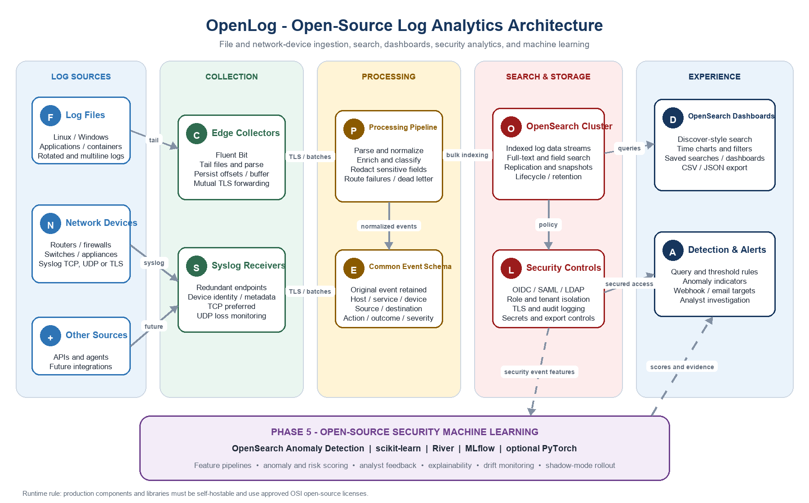

# Net Sec Watch project specification

**Author:** SJ du Preez

> This Markdown document is the repository-native version of the product
> and technical specification.

**Document type:** Product and technical project specification

**Status:** Draft for discovery and implementation planning

**Prepared:** 19 June 2026

**Reference stack:** Fluent Bit + OpenSearch + OpenSearch Dashboards

**Target users:** IT operations, network operations, security operations, and developers

| Recommendation  Build the first release as a self-hosted OpenSearch platform with Fluent Bit collectors. This provides a Kibana-like Discover experience, full-text search, dashboards, retention controls, and support for both files and router/firewall syslog without proprietary licensing. |
| --- |

## 1. Executive summary

Net Sec Watch is a centralized observability tool that collects logs from local files, servers, applications, containers, routers, firewalls, and other network devices. It normalizes and indexes those events, then exposes a fast browser-based interface for free-text search, field filters, time-range analysis, dashboards, saved searches, and export.

The platform is designed to remain fully self-hostable using open-source components. The recommended implementation uses Fluent Bit at the collection edge, optional processing pipelines for parsing and enrichment, OpenSearch for indexed storage, and OpenSearch Dashboards for the user interface. Standard protocols and schemas prevent lock-in.

## 2. Objectives and boundaries

### 2.1 Goals

- Collect continuously from text log files, rotated files, application logs, container logs, and operating-system logs.
- Receive RFC 3164/RFC 5424-style syslog over TCP or UDP from routers, firewalls, switches, wireless controllers, and appliances.
- Provide a Kibana-like log exploration experience with a time picker, query bar, fields, filters, histograms, and event detail.
- Normalize common fields so users can search consistently across vendors and log sources.
- Support secure multi-user access, role-based permissions, encryption in transit, and auditability.
- Provide configurable retention, rollover, deletion, snapshots, health monitoring, and capacity reporting.
- Deploy on virtual machines, bare metal, or Kubernetes using only free and open-source, self-hostable software and libraries.
- Add a layer machine-learning capability for security anomaly detection, prioritization, and analyst-assisted investigation.
### 2.2 Open-source and free-software policy

All production runtime components, client libraries, machine-learning frameworks, models, deployment tooling, and required plugins must be free to use and available under an OSI-approved open-source license. The solution must operate without paid APIs, proprietary cloud services, license keys, feature-gated enterprise modules, or mandatory vendor subscriptions.

- Preferred licenses are Apache 2.0, BSD, MIT, MPL 2.0, or another approved license compatible with the intended distribution and use.
- Every dependency and model artifact must be recorded in a software bill of materials with its version, source, license, and security status.
- Optional commercial support may be purchased, but it must not be required to install, operate, secure, scale, or recover the platform.
- Any proposed dependency that is source-available but not OSI-approved requires explicit legal and architecture approval and is excluded by default.
### 2.3 Non-goals for the first release

- A full commercial SIEM replacement with packaged compliance content for every regulation.
- Long-term packet capture or full network payload inspection.
- A proprietary agent required on every source system.
- Automatic remediation of security incidents.
- Unlimited retention without explicit storage and cost planning.
## 3. Users and primary use cases

| User | Primary need | Representative questions |
| --- | --- | --- |
| Network operator | Troubleshoot routing, VPN, firewall, and device events | Why was traffic denied? Which device is flapping? |
| Security analyst | Investigate authentication, policy, and threat events | Which source IP triggered repeated failures? |
| Platform engineer | Diagnose applications and infrastructure | What changed before the error spike? |
| Service desk | Find evidence without direct server access | Did the user request reach the application? |
| Administrator | Operate and govern the platform | Are collectors healthy? When will storage fill? |

## 4. Functional requirements

| ID | Capability | Requirement | Priority |
| --- | --- | --- | --- |
| FR-01 | File collection | Watch one or more file paths, including wildcards and rotated files; persist offsets so collection resumes after restart. | Must |
| FR-02 | Multiline handling | Combine stack traces and other multiline records using configurable parsers. | Must |
| FR-03 | Syslog reception | Receive TCP and UDP syslog on configurable ports and preserve sender address and raw message. | Must |
| FR-04 | Parsing | Parse JSON, key-value, CSV, regex/grok-like patterns, RFC syslog, and vendor-specific formats. | Must |
| FR-05 | Normalization | Map events to a common schema while retaining the original event. | Must |
| FR-06 | Enrichment | Add source, environment, site, device type, collector, tags, and optional GeoIP metadata. | Should |
| FR-07 | Buffering | Queue events during destination interruption and resume delivery without operator intervention. | Must |
| FR-08 | Search | Search by free text, exact fields, ranges, Boolean logic, wildcards, and time range. | Must |
| FR-09 | Discover view | Show event histogram, sortable results, selectable fields, filters, event expansion, and surrounding context. | Must |
| FR-10 | Saved content | Save and share searches, visualizations, dashboards, and filter sets. | Must |
| FR-11 | Export | Export a bounded result set as CSV or JSON with authorization and audit logging. | Should |
| FR-12 | Alerts | Create threshold and query-based alerts with webhook/email-compatible notification targets. | Should |
| FR-13 | Retention | Apply per-log-class rollover, retention, deletion, and snapshot policies. | Must |
| FR-14 | Administration | Display pipeline status, ingestion rate, failures, queue depth, index health, and storage consumption. | Must |
| FR-15 | API | Expose authenticated APIs for ingestion, search, configuration automation, and health checks. | Must |
| FR-16 | Security ML | Score selected security events for anomalies and risk, show contributing features, and support analyst feedback without automatic blocking. | Later phase |

## 5. User experience specification

### 5.1 Search and discovery

- Default view opens to the most recent 15 minutes and refreshes on demand or at a selected interval.
- A query bar supports simple free-text searching and an advanced query language for fielded expressions.
- Users can add include/exclude filters directly from field values in an event.
- A time histogram summarizes event volume and updates with every query.
- The results grid supports configurable columns, sorting, pagination, and event expansion.
- Expanded events show normalized fields, original raw message, source metadata, and a copyable JSON representation.
- The interface clearly distinguishes no results, delayed ingestion, permission restrictions, and query errors.
### 5.2 Example searches

| Intent | Example |
| --- | --- |
| Firewall denies from a source | event.action:"deny" AND source.ip:"203.0.113.10" |
| Errors on a service | service.name:"payments" AND log.level:(ERROR OR FATAL) |
| VPN failures in the last hour | event.category:"authentication" AND device.type:"firewall" AND event.outcome:"failure" |
| Raw message contains a phrase | "connection reset by peer" |

## 6. Proposed architecture

### 6.1 Component responsibilities

| Layer | Recommended component | Responsibility |
| --- | --- | --- |
| Collection | Fluent Bit | Tail files, receive syslog, parse common formats, tag events, buffer, and forward. |
| Processing | Fluent Bit filters and/or OpenSearch ingest pipelines | Normalize fields, redact secrets, enrich metadata, route failures, and set target data stream. |
| Search storage | OpenSearch | Index events, execute search and aggregations, replicate data, manage lifecycle policies, and snapshot. |
| User interface | OpenSearch Dashboards | Discover-style exploration, dashboards, saved searches, visualizations, administration, and alerts. |
| Identity | OpenSearch Security with an external IdP where available | Authentication, role mapping, tenant/workspace separation, and audit controls. |
| Monitoring | OpenSearch monitoring plus Prometheus/Grafana where desired | Collect platform metrics, health, capacity, and service-level indicators. |

### 6.2 File ingestion flow

1. A Fluent Bit agent runs on the host or as a container/DaemonSet and tails configured paths.
2. The collector stores file inode and offset state locally to survive restarts and log rotation.
3. Parsers assemble multiline events and extract timestamps, severity, service, host, and message fields.
4. Events are buffered, sent over authenticated TLS, normalized, and bulk-indexed into a time-partitioned data stream.
5. Malformed events are routed to a dead-letter index with the parse error and original message.
### 6.3 Router and firewall ingestion flow

1. Each network device forwards syslog to two virtual IPs or redundant collector addresses where supported.
2. Collectors listen on a non-privileged configurable port such as TCP/6514 for TLS syslog or TCP/UDP 5140 behind controlled network rules.
3. The receiver records sender IP, transport, receive timestamp, device identity, and the original message.
4. Vendor parsers extract action, rule, interface, source/destination addresses and ports, protocol, bytes, session, and severity.
5. Normalized events are routed to network or security data streams and made searchable within the ingestion latency objective.
| Transport guidance  Prefer TCP with TLS when the device supports it. UDP may be retained for legacy devices, but it does not guarantee delivery and requires explicit loss monitoring and receiver-buffer tuning. |
| --- |

## 7. Event schema and parsing

The canonical schema should use stable, vendor-neutral names. Where practical, align with the OpenTelemetry Logs data model and common security-event conventions. Every event retains event.original so parsers can be corrected and events can be reprocessed.

| Field | Type | Purpose |
| --- | --- | --- |
| @timestamp | date | Source event time in UTC; receive time is stored separately. |
| message | text | Human-readable normalized event message. |
| event.original | keyword/text | Unmodified source line or syslog payload. |
| host.name / host.ip | keyword / IP | Originating server or appliance. |
| device.vendor / device.product / device.type | keyword | Network-device identification. |
| service.name | keyword | Application or service identity. |
| log.level | keyword | Normalized severity such as debug, info, warn, error, critical. |
| event.category / event.action / event.outcome | keyword | Cross-source classification. |
| source.* / destination.* | object | Network address, port, user, geo, and related context. |
| observer.* | object | Collector or intermediary that observed the event. |
| labels.* | keyword | Controlled environment, site, team, and routing labels. |

### 7.1 Timestamp rules

- Store all indexed timestamps in UTC while preserving the original timezone or offset when present.
- If an event lacks a year or timezone, apply a source-specific rule and mark timestamp.inferred=true.
- If parsing fails, index using the receive timestamp and add error.type=timestamp_parse_failure.
- Monitor clock skew and expose sources whose event time differs materially from receive time.
## 8. Non-functional requirements

| ID | Quality | Target |
| --- | --- | --- |
| NFR-01 | Availability | Production target: 99.9% monthly availability for search and ingestion, excluding agreed maintenance. |
| NFR-02 | Ingestion latency | 95% of accepted events searchable within 10 seconds under normal load; 99% within 60 seconds. |
| NFR-03 | Search responsiveness | 95% of standard seven-day queries return the first page within 3 seconds at the agreed design load. |
| NFR-04 | Durability | Acknowledged TCP/file events survive a single collector or data-node failure; UDP is explicitly best effort. |
| NFR-05 | Scale | Scale collectors and OpenSearch data nodes horizontally without application redesign. |
| NFR-06 | Recovery | Configuration is source-controlled; snapshots support restoration to a clean cluster. |
| NFR-07 | Accessibility | Core search and administration workflows support keyboard navigation and readable contrast. |
| NFR-08 | Portability | Deployment artifacts support Linux VMs and Kubernetes; no mandatory public-cloud service. |
| NFR-09 | License | Runtime dependencies must use OSI-approved open-source licenses; exceptions require documented approval. |

## 9. Security and privacy

- Encrypt browser, API, collector, and cluster traffic using TLS. Use mutual TLS for collectors where operationally practical.
- Integrate with OIDC, SAML, LDAP, or Active Directory; local accounts are reserved for bootstrap and emergency use.
- Define roles for platform administrators, data-source owners, analysts, read-only users, and service accounts.
- Restrict data by index/data stream, tenant/workspace, field, or document where required.
- Audit authentication, role changes, configuration changes, exports, and privileged searches.
- Redact or hash credentials, tokens, personal data, and regulated identifiers before indexing whenever feasible.
- Store secrets in a dedicated secret manager or protected deployment secret, never in source control.
- Rate-limit exposed ingestion and search endpoints and isolate collectors from the public internet.
| Privacy principle  Logs frequently contain more sensitive data than expected. Collection onboarding must include a data-classification and redaction review before a source is enabled in production. |
| --- |

## 10. Retention, lifecycle, and storage

Retention is policy-driven by data class rather than one global setting. The initial policies below are starting points and must be approved against legal, operational, and storage constraints.

| Data class | Hot searchable | Warm/searchable | Delete or archive |
| --- | --- | --- | --- |
| Critical security and firewall | 14-30 days | Up to 90-180 days | Snapshot/archive or delete per policy |
| Infrastructure and application | 7-14 days | Up to 30-90 days | Delete unless incident hold applies |
| Debug/high-volume | 1-3 days | Optional | Delete quickly |
| Dead-letter / parse failures | 7 days | Not required | Delete after parser correction |

Sizing formula: daily indexed storage = raw daily bytes × parsing/index expansion factor. Use a measured factor from representative logs, then add replica storage, watermarks, merge headroom, growth, and snapshot capacity. A pilot must measure actual event size and compression before production sizing.

## 11. Deployment and environments

### 11.1 Minimum environments

- Development: single-node or small non-production cluster with synthetic and sanitized logs.
- Test/staging: production-like security, parsers, lifecycle policies, dashboards, and load tests.
- Production: minimum three cluster-manager-capable nodes, dedicated data capacity sized from measured load, redundant collectors, and external snapshot storage.
### 11.2 Deployment options

| Option | Best fit | Notes |
| --- | --- | --- |
| Docker Compose | Developer evaluation and demos | Fast start; not the production reference design. |
| Linux VMs | Small and medium installations | Straightforward operations; automate with Ansible or equivalent. |
| Kubernetes/Helm | Larger or cloud-native environments | Supports standardized rollout and scaling; requires experienced stateful-workload operations. |

## 12. Operations and observability

- Monitor accepted, dropped, retried, buffered, and failed events by collector and source.
- Alert on collector silence, unexpected volume changes, parse-failure rate, queue growth, rejected writes, high JVM pressure, disk watermarks, unassigned shards, and snapshot failures.
- Provide runbooks for node failure, collector backlog, expired certificates, mapping conflicts, disk pressure, failed upgrades, and restore testing.
- Back up configuration, index templates, lifecycle policies, security configuration, dashboards, and saved objects in source control or automated exports.
- Perform quarterly restore tests and at least annual disaster-recovery exercises.
- Use rolling upgrades and maintain a version-support policy; test collector and cluster compatibility before upgrades.
## 13. Integration interfaces

| Interface | Protocol/format | Purpose |
| --- | --- | --- |
| File source | Local filesystem; UTF-8 by default | Tail files and preserve offsets. |
| Network device | Syslog TCP/UDP; TLS where supported | Receive router/firewall/appliance events. |
| Collector to platform | HTTPS/TLS bulk API or supported OpenSearch output | Reliable batched ingestion. |
| Search API | Authenticated HTTPS/JSON | Application and automation queries. |
| Alert destination | Webhook; SMTP-compatible relay where configured | Notify ticketing, chat, or email systems. |
| Identity provider | OIDC, SAML, LDAP/AD | Central authentication and role mapping. |
| Snapshot repository | S3-compatible object storage or supported filesystem repository | Backup and disaster recovery. |

## 14. Delivery plan

| Phase | Indicative duration | Deliverables and exit criteria |
| --- | --- | --- |
| 0. Discovery and sizing | 2 weeks | Inventory sources, sample logs, classify data, estimate volume, confirm retention, define success metrics. |
| 1. Technical proof of concept | 2-3 weeks | One file source and one firewall/router source searchable; basic dashboard; parser and latency measurements. |
| 2. MVP | 4-6 weeks | Secure authentication, redundant collectors, core schema, retention, monitoring, backups, onboarding guide, and acceptance tests. |
| 3. Production hardening | 3-4 weeks | HA cluster, load/failure tests, restore test, runbooks, security review, capacity threshold, and operational handover. |
| 4. Expansion | Ongoing | Additional vendors/sources, alert content, dashboard library, automation, and cost/performance tuning. |
| 5. Security machine learning | 6-10 weeks | Open-source anomaly detection, feature pipelines, analyst feedback, model evaluation, explainable risk scoring, shadow deployment, and controlled production rollout. |

## 15. Security machine-learning phase

This phase adds machine-learning analysis after the collection, schema, security, and operational foundations are stable. It is intended to improve analyst prioritization and reveal unusual behavior; it does not replace deterministic detection rules or human investigation.

### 15.1 Initial security use cases

- Detect unusual authentication failure rates by user, source, destination, device, site, and time of day.
- Identify rare or newly observed source/destination communication patterns, ports, protocols, and firewall-rule activity.
- Detect volume, severity, or behavior changes for a host, service, router, or firewall compared with its own baseline.
- Prioritize correlated events using transparent risk scoring based on anomaly score, asset criticality, rule matches, and known threat indicators.
- Group similar alerts or events to reduce duplicate analyst work and expose common campaigns or failure modes.
### 15.2 Recommended free and open-source ML approach

| Capability | Preferred library/component | Use |
| --- | --- | --- |
| Built-in anomaly detection | OpenSearch Anomaly Detection | Establish streaming baselines and anomaly grades close to indexed data. |
| Classical ML | scikit-learn | Isolation Forest, clustering, classification, preprocessing, metrics, and offline experiments. |
| Online/streaming ML | River | Incremental models and drift-aware learning where event patterns change continuously. |
| Deep learning, if justified | PyTorch | Sequence or representation models only after simpler methods prove insufficient. |
| Experiment tracking | MLflow | Track datasets, parameters, metrics, artifacts, approvals, and reproducible model versions. |
| Data and features | Python, pandas/Polars, NumPy, OpenSearch APIs | Build reproducible feature pipelines using only self-hosted open-source libraries. |

### 15.3 ML delivery workflow

1. Select one or two measurable security use cases and define the analyst decision the model will support.
2. Create privacy-reviewed training and evaluation datasets from normalized logs; prevent leakage from future events and incident labels.
3. Build baseline statistical and rule-based methods before testing more complex models.
4. Evaluate precision, recall, false-positive rate, alert reduction, time-to-detect, stability, and analyst usefulness across representative periods.
5. Run the selected model in shadow mode so scores are recorded but do not notify or change production actions.
6. Review results with security analysts, tune thresholds, document limitations, and approve a controlled alerting rollout.
7. Monitor data quality, feature drift, score drift, latency, resource use, and analyst feedback; retrain or retire models through a governed process.
### 15.4 ML safeguards and governance

- No machine-learning result automatically blocks traffic, disables an account, or changes a firewall policy in the initial implementation.
- Every alert shows the model version, anomaly/risk score, time window, affected entities, and the most important contributing features or evidence.
- Training data and model artifacts inherit the access controls, retention, encryption, and audit requirements of the source logs.
- Analyst feedback is recorded separately from raw events and is reviewed for bias, inconsistency, and label quality before retraining.
- Models have named owners, approval status, intended use, prohibited use, validation results, rollback instructions, and retirement criteria.
- Open-source model licenses and training-data rights are reviewed before deployment; API-only or non-redistributable models are not permitted.
### 15.5 ML phase acceptance criteria

| ID | Acceptance criterion |
| --- | --- |
| ML-AC-01 | At least one authentication or network anomaly use case runs continuously against production-like data in shadow mode. |
| ML-AC-02 | The model and its complete runtime dependency chain use approved free and open-source licenses and require no paid service. |
| ML-AC-03 | Evaluation uses time-separated holdout data and reports precision, recall, false-positive rate, alert volume, and detection latency. |
| ML-AC-04 | Analysts can inspect contributing evidence, classify a result, and record feedback without modifying the original event. |
| ML-AC-05 | Data-quality and drift monitoring raises an operational alert when configured thresholds are exceeded. |
| ML-AC-06 | A documented rollback disables model-generated alerts without interrupting normal log ingestion, search, or rule-based detections. |

## 16. Testing strategy

- Parser unit tests using golden input/output samples for every supported source and firmware/application variant.
- End-to-end tests proving that file and syslog events become searchable with expected normalized fields.
- Rotation and restart tests validating persisted file offsets and duplicate/loss behavior.
- Load tests at 1.5 times expected peak ingestion and concurrent search demand.
- Failure tests covering destination outage, collector restart, data-node loss, network interruption, certificate expiry, and disk watermark conditions.
- Security tests for authentication, role boundaries, tenant isolation, TLS, secret handling, export controls, and audit events.
- Machine-learning tests for dataset leakage, reproducibility, model performance, drift, explainability, resource limits, rollback, and adversarial or malformed inputs.
- Upgrade and restore tests before each production release.
## 17. MVP acceptance criteria

| ID | Acceptance criterion |
| --- | --- |
| AC-01 | A configured application log file is tailed through rotation and restart without losing acknowledged records. |
| AC-02 | A selected router or firewall sends syslog and its events appear with device, action, source, destination, severity, and original message fields. |
| AC-03 | An authorized user can search by text, field, Boolean condition, and time range and can save the search. |
| AC-04 | The Discover view displays a histogram, selected columns, filters, expanded event details, and raw JSON. |
| AC-05 | Unauthorized users cannot access restricted log classes, dashboards, or exports. |
| AC-06 | Retention automatically rolls over and removes test indexes according to policy. |
| AC-07 | A simulated destination outage causes buffering and later recovery, with backlog and failures visible to operators. |
| AC-08 | 95% of events are searchable within 10 seconds at the agreed normal-load test profile. |
| AC-09 | A snapshot is restored into a clean test environment and a known event can be retrieved. |
| AC-10 | Operational documentation covers onboarding, common failures, backup/restore, certificate rotation, and escalation. |

## 18. Risks and mitigations

| Risk | Impact | Mitigation |
| --- | --- | --- |
| Uncontrolled field creation / mapping explosion | Index instability and memory pressure | Use templates, controlled schemas, flattened fields, and parser review. |
| Unexpected log volume | Storage exhaustion and rejected writes | Measure early, enforce watermarks, define quotas, sample low-value debug data, and alert on growth. |
| UDP packet loss | Missing device events | Prefer TCP/TLS, tune buffers, monitor sequence/volume, and document best-effort sources. |
| Sensitive data in logs | Privacy or security exposure | Classify, redact at the collector, restrict access, shorten retention, and audit exports. |
| Parser drift after vendor upgrade | Unsearchable or misclassified events | Maintain golden samples, parse-failure dashboards, and staged firmware/application onboarding. |
| Operational complexity | Poor reliability or slow incident response | Automate deployment, keep runbooks, train owners, and start with a bounded source set. |
| Open-source version churn | Upgrade risk | Pin supported versions, monitor security notices, test upgrades, and maintain rollback/restore procedures. |
| ML false positives or concept drift | Analyst fatigue and missed threats | Start in shadow mode, use analyst feedback, monitor drift, retain deterministic rules, and apply rollback thresholds. |
| Opaque or biased ML scoring | Untrusted or unfair security decisions | Use explainable features, document intended use, review labels, and prohibit autonomous enforcement. |

## 19. Open decisions and discovery questions

- What is the average and peak daily ingestion volume, events per second, and largest single event?
- Which router and firewall vendors, models, firmware versions, and transport options must be supported first?
- What are the required retention periods by log class and jurisdiction?
- Is an existing identity provider available, and are tenant or departmental boundaries required?
- Will the platform run on VMs, Kubernetes, or both, and what snapshot storage is available?
- Which alerts and dashboards are mandatory for the MVP?
- Are regulated data, customer identifiers, credentials, or secrets likely to appear in the logs?
- What recovery-time and recovery-point objectives are required?
- Which security anomaly use case has enough historical data and analyst capacity to support a measurable ML pilot?
## 20. Recommended free and open-source stack

| Component | Role | License / rationale |
| --- | --- | --- |
| Fluent Bit | File tailing, syslog reception, parsing, filtering, buffering, forwarding | Apache 2.0; lightweight and supports both required input types. |
| OpenSearch | Indexed storage, full-text search, aggregations, lifecycle, snapshots | Apache 2.0; search and analytics engine designed for self-hosting. |
| OpenSearch Dashboards | Kibana-like Discover, dashboards, saved objects, administration | Apache 2.0 and purpose-built for OpenSearch. |
| Prometheus + Grafana (optional) | Platform metrics and infrastructure dashboards | Open-source monitoring complement; not required for log search. |
| Ansible or Helm | Repeatable deployment | Open-source automation selected according to the hosting platform. |
| OpenSearch Anomaly Detection | Streaming security and operational anomaly detection | Apache 2.0 OpenSearch capability; keeps the initial ML implementation self-hosted. |
| scikit-learn + River | Offline and online machine-learning analysis | BSD-licensed libraries suitable for transparent baseline models and streaming learning. |
| PyTorch (optional) | Advanced deep-learning models | BSD-style open-source license; use only when simpler methods do not meet the use case. |
| MLflow | Experiment and model lifecycle tracking | Apache 2.0; self-hostable tracking and artifact management. |

Alternative: Grafana Loki can be considered where low-cost label-based log storage is more important than broad full-text indexed search. For this requirement, OpenSearch is the stronger default because the requested experience is explicitly similar to Kibana.

## 21. Sources and implementation references

- OpenSearch platform and Apache 2.0 licensing
- OpenSearch Dashboards: exploring data with Discover
- OpenSearch security documentation
- Fluent Bit Tail input
- Fluent Bit Syslog input
- Fluent Bit project license
- OpenSearch Anomaly Detection
- scikit-learn project and license information
- River open-source license
- PyTorch open-source license
- MLflow documentation
| Versioning note  Component versions should be selected during implementation from currently supported releases, pinned in deployment manifests, and validated together in staging. This specification intentionally defines capabilities rather than hard-coding a version number. |
| --- |
